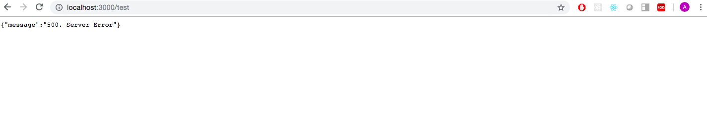

# Handle Errors with Express

## Objectives

- To build a server with ExpressJS.
- To read files in ExpressJS.
- To handle errors in ExpressJS.

## Sprints

1) Create project folder for this project.

2) Create an Express app.

3) Read a file `index.html`.

4) Define a single route to show html data in browser from `index.html`.

5) Generate cases to test handling of errors:

    5.1)  Handle error 500 - Server Error.

    5.2) Handle error 404 - Not Found.

6)  Launch script.

## Deliverables

- When you run 'app.js' …

```
$ node app.js
Node Server is running on PORT: 3000
```

- When you run 'app.js' with an error 404 browser looks like…


- When you run 'app.js' with an error 500 browser looks like…



